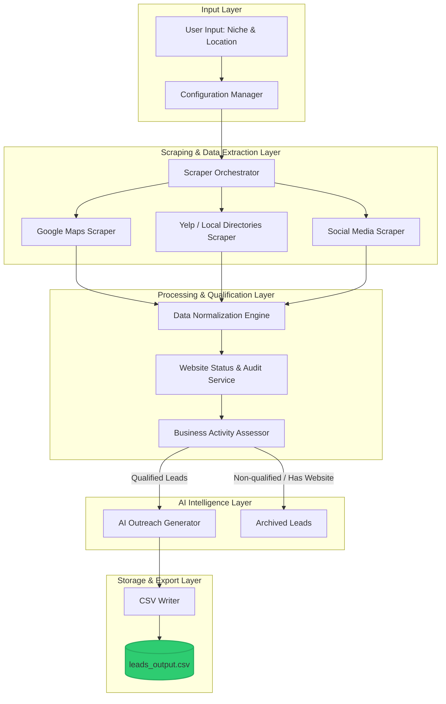

# System Architecture: AI Lead Finder Agent

This document details the software architecture, data flows, and technical stack for the **AI Lead Finder Agent**, designed to scan digital platforms, identify businesses lacking websites or having poor web presence, qualify them, and output lead lists to a `.csv` file.

---

## 1. System Overview

The system is designed as a modular, pipeline-based architecture. It takes target parameters (niche and location) as input, processes data through distinct stages, and outputs a structured CSV file with personalized sales copy.



---

## 2. Technology Stack

To ensure rapid development, reliability, and easy maintenance, the following stack is recommended:

| Component | Technology | Rationale |
| :--- | :--- | :--- |
| **Language** | Python 3.10+ | Standard language for data scraping, processing, and AI integrations. |
| **Orchestrator & CLI** | Click / Typer | Provides a clean Command Line Interface (CLI) to trigger runs. |
| **Scraping Engine** | Playwright (Python) | Headless browser automation capable of handling dynamic, JS-heavy pages (like Google Maps & Instagram) without getting easily blocked. |
| **Data Manipulation** | Pandas | High-performance tool to normalize, filter, and write data to `.csv`. |
| **Website Auditing** | `httpx` + `beautifulsoup4` | Asynchronous HTTP client to quickly check site headers, SSL, and parse HTML for meta tags. |
| **AI Personalization** | Google Gemini API (or OpenAI) | Large Language Models to generate tailored, context-specific cold pitches. |

---

## 3. Component Details

### A. Scraping & Data Extraction Module
This module is responsible for search queries and fetching raw business data.
* **Google Maps Scraper:** Executes a search query (e.g., `Plumbers in Chicago`) and scrolls through list elements. It extracts:
  * Business Name
  * Address
  * Phone Number
  * Google Maps URL (Location Link)
  * Listed Website URL
  * Review Count and Rating
* **Social Media Scraper (Optional Add-on):** Fetches the business's social media page if listed on Google Maps to verify if they have posted recently.

### B. Website Status & Audit Service
Analyzes the extracted website URL to verify if the business actually needs a website:
* **Missing Check:** If the website URL is empty, mark as `NO_WEBSITE`.
* **Link Validity Check:** Ping the URL via an asynchronous `GET` request. If it returns `404`, `500`, or times out, mark as `BROKEN_WEBSITE`.
* **Design & Responsive Audit:** Fetch the page source. Check if it contains modern viewport tags or uses outdated layouts (e.g., tables, missing HTTPS/SSL certificates).

### C. Business Activity Assessor (Qualification)
Ensures we do not pitch to inactive or dead businesses:
* Calculates an **Activity Score** based on:
  * Google Reviews: Number of reviews and the date of the most recent review. (e.g., Active if >= 1 review in the last 90 days).
  * Platform verification: Active business hours listed.

### D. AI Outreach Generator
Takes the data of *qualified leads* and passes it to an LLM prompt:
* **Prompt Template:**
  ```text
  You are an expert sales copywriter. Write a short, highly personalized cold pitch to [Business Name] based in [Address]. 
  They do not have a website, but they have a strong presence on [Platform] with [Review Count] reviews and [Rating] stars.
  Explain the benefit of having a website for [Niche] in 3 sentences, offering a custom booking system.
  ```

### E. Storage & Export Module (CSV Writer)
Structures the final output into a CSV format.

---

## 4. Database & CSV Schema

The final output is saved to a `.csv` file. The schema is defined below:

| Column Header | Data Type | Description | Example |
| :--- | :--- | :--- | :--- |
| `business_name` | String | Name of the business | Chicago Plumbing Pro |
| `address` | String | Physical address of the business | 123 Main St, Chicago, IL 60601 |
| `location_link` | String | Link to the platform where found (e.g., Google Maps) | `https://google.com/maps/place/...` |
| `phone_number` | String | Contact number | +1-312-555-0199 |
| `website_status` | String | Status of their web presence (`NONE`, `BROKEN`, `OUTDATED`) | `NONE` |
| `activity_score` | Float | Score indicating active business status (0.0 to 1.0) | `0.85` |
| `ai_pitch_draft` | String | Custom draft message generated for outreach | "Hi Team, we noticed your 4.8-star review rating on Maps..." |

---

## 5. Security, Rate Limiting & Ethics

To ensure the system runs smoothly and complies with platform regulations:
1. **User-Agent Rotation:** The scraper must rotate User-Agent headers to avoid fingerprinting.
2. **Request Throttling:** Introduce random delays (`1s` to `5s`) between page clicks and scrolls to mimic human behavior.
3. **Proxy Support:** Integrated support for rotating proxy networks to handle large bulk searches across multiple cities.
4. **Local Storage Caching:** Store scraped records locally in a temporary SQLite database before exporting to CSV. This prevents data loss if a run crashes midway.
