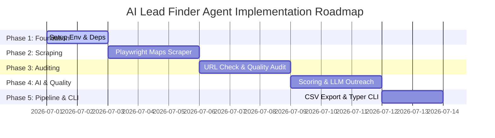

# Implementation Plan: AI Lead Finder Agent

This document outlines the phase-by-phase implementation plan for building the **AI Lead Finder Agent**. The implementation is structured to build the core functionality first (scraping and CSV exporting) before adding validation, qualification, and AI outreach features.

---

## Phase-by-Phase Roadmap



---

## Phase 1: Project Setup & Environment Configuration
**Goal:** Establish the repository structure, virtual environment, and dependency management.

### Tasks:
1. **Initialize Project Files:**
   * Create the directory structure:
     ```text
     ai-agent/
     ├── docs/                 # Documentation (problem_statement, architecture, etc.)
     ├── src/
     │   ├── __init__.py
     │   ├── scraper.py        # Maps & platform scraping logic
     │   ├── auditor.py        # Website verification & auditing
     │   ├── ai_generator.py   # LLM prompt and pitch creation
     │   └── utils.py          # Helper functions (CSV, logs, DB)
     ├── main.py               # Application entrypoint
     ├── requirements.txt      # Dependency lists
     └── .env.example          # Environment variable template
     ```
2. **Setup Dependencies:**
   * Create `requirements.txt` with:
     ```text
     playwright>=1.40.0
     pandas>=2.0.0
     httpx>=0.25.0
     beautifulsoup4>=4.12.0
     google-generativeai>=0.3.0
     python-dotenv>=1.0.0
     typer>=0.9.0
     ```
3. **Configure Environment Variables:**
   * Create `.env` based on `.env.example`:
     ```bash
     GEMINI_API_KEY=your_gemini_api_key_here
     SCRAPE_DELAY_MIN=1
     SCRAPE_DELAY_MAX=4
     HEADLESS_MODE=True
     ```

---

## Phase 2: Scraper Development (Google Maps)
**Goal:** Implement browser automation to search Google Maps for local businesses, extract details, and save them in a structured python representation.

### Tasks:
1. **Initialize Playwright Scraper:**
   * Implement head/headless browser setup inside `src/scraper.py`.
   * Handle navigation to Google Maps: `https://www.google.com/maps`.
2. **Execute Search & Scroll Loop:**
   * Search for `"{Niche} in {Location}"` (e.g., `Plumbers in Chicago`).
   * Automate scrolling in the left-hand panel of Google Maps to dynamically load all results.
3. **Extract Target Fields:**
   * Parse each search card for the following fields:
     * **Business Name**
     * **Address** (Formatted address string)
     * **Location Link** (Google Maps URL)
     * **Phone Number**
     * **Website URL** (if listed)
     * **Reviews Count & Rating** (for qualification)

---

## Phase 3: Website Status & Audit Engine
**Goal:** Build a validation tool that takes listed URLs, checks their accessibility, and audits their quality.

### Tasks:
1. **Asynchronous URL Validator (`src/auditor.py`):**
   * Use `httpx` to send asynchronous HTTP requests to listed URLs to check status codes.
   * Map URL conditions:
     * No URL listed -> `NONE`
     * Server errors (e.g., 404, 500) or Timeout -> `BROKEN`
     * Successful ping -> Check design layout
2. **Simple Design & SEO Auditor:**
   * Parse website HTML using `beautifulsoup4`.
   * Check for mobile responsiveness (presence of `<meta name="viewport"...>`).
   * Check for security features (HTTPS/SSL).
   * Check for empty/outdated styling, flagging old layouts.

---

## Phase 4: Business Qualification & AI Outreach Generator
**Goal:** Score the activity levels of businesses and use LLMs to write tailored cold emails/messages.

### Tasks:
1. **Activity Scoring Logic:**
   * Formulate an `activity_score` (between 0.0 and 1.0) using criteria:
     * High rating + recent reviews = High activity score.
     * Low review count / outdated review dates = Low activity score.
2. **AI Lead Outreach Module (`src/ai_generator.py`):**
   * Integrate the `google-generativeai` SDK.
   * Construct a prompt template utilizing lead variables:
     * `business_name`, `niche`, `rating`, `review_count`, `location`.
   * Request the LLM to output a personalized 3-sentence sales pitch targeting the specific business's lack of website.

---

## Phase 5: Storage Pipeline & CLI Integration
**Goal:** Tie all modules together, implement execution commands, and output data directly into the target `.csv` file.

### Tasks:
1. **Pandas Integration (`src/utils.py`):**
   * Convert list of business lead dictionaries into a Pandas DataFrame.
   * Structure column headers according to the approved CSV schema.
   * Write data to `leads_output.csv`.
2. **SQLite Cache Implementation:**
   * Create a lightweight local SQLite database to cache raw scraped results before running the audit and LLM scripts. This ensures that if the LLM api fails or hits a rate limit, the scraper data is not lost.
3. **Command Line Interface (`main.py`):**
   * Create commands using `typer` to launch the scraper:
     ```bash
     python main.py run --niche "Plumbers" --location "Chicago" --output "leads.csv"
     ```

---

## Phase 6: E2E Verification & Safety Features
**Goal:** Test the pipeline end-to-end, check file outputs, and add rate-limiting measures.

### Tasks:
1. **Safety Implementations:**
   * Set random delays between scraper page actions to prevent IP blocking.
   * Implement User-Agent rotation.
2. **Verification Checklist:**
   * Run script for a test location (e.g., `Bakery in local town`).
   * Verify that `leads_output.csv` contains all headers: `business_name`, `address`, `location_link`, `phone_number`, `website_status`, `activity_score`, `ai_pitch_draft`.
   * Assert CSV file can be opened correctly in spreadsheet software.
