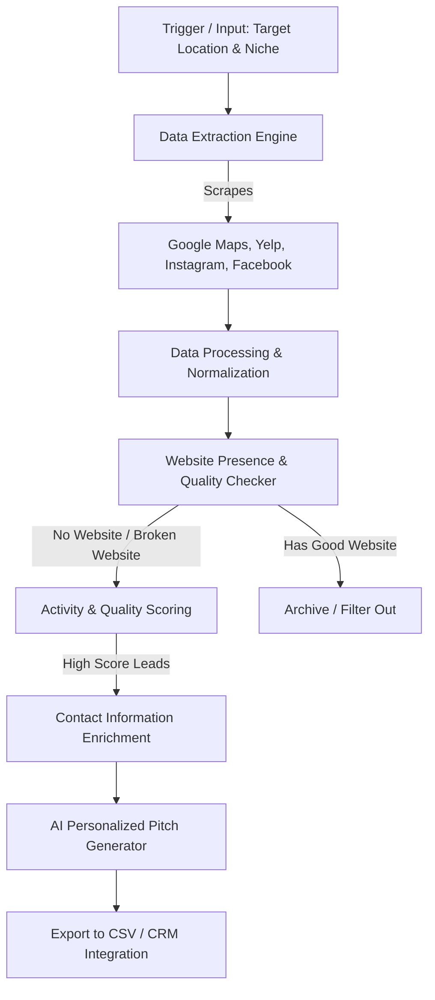

# Problem Statement: AI Agent for Website Lead Generation and Qualification

## 1. Executive Summary
In the modern digital economy, having a dedicated website is a fundamental requirement for business credibility, search engine visibility (SEO), and operational independence. However, millions of active local businesses and service providers (e.g., contractors, restaurants, local shops, freelancers) operate without a website, relying solely on third-party platforms like Google Maps, Yelp, Instagram, or Facebook. 

Concurrently, web development agencies, SaaS platforms, and freelancers struggle to efficiently identify, verify, and pitch their services to these high-intent leads. This project proposes an **autonomous AI Agent** designed to crawl digital platforms, identify active businesses lacking a proper web presence, and qualify them as prime targets for website design and development services.

---

## 2. Background and Context
Small and Medium-sized Businesses (SMBs) often start their digital journey by creating free profiles on map directories or social media. While this provides immediate visibility, it comes with severe limitations:
* **Platform Dependency:** Algorithm changes, account suspensions, or policy shifts on platforms like Meta or Google can instantly disrupt a business's primary channel of customer acquisition.
* **Lack of Branding and Customization:** Social media profiles offer limited layout customization, making it difficult to build a premium brand identity or integrate complex workflows (like bookings, custom forms, or e-commerce).
* **Poor Search Discoverability:** Relying purely on platform directories makes it harder to rank on search engine results pages (SERPs) for localized terms compared to having a dedicated, SEO-optimized domain.

For web development service providers, finding these businesses manually is tedious and expensive. Existing lead databases (like ZoomInfo or Apollo) are often outdated, lack granular data on a business's current website status, and do not track active engagement levels on social media.

---

## 3. The Core Problem Statement
> **"Web design agencies and freelancers waste significant time and capital manually prospecting for leads, while active local businesses remain digitally underserved because they lack an automated, reliable way to connect with creators who can build their online presence."**

### Key Dimensions of the Problem:
1. **Inefficient Manual Prospecting:** Sales teams must manually search Google Maps or social media, click through profiles to find a website link, verify if the link works, assess if the website is mobile-friendly, and look for contact info. This process takes 5–10 minutes per business, leading to extremely low outreach volume.
2. **Outdated Lead Lists:** Static databases do not reflect real-time changes. A business that didn't have a website six months ago might have built one yesterday, or their domain might have expired recently.
3. **Low Conversion Rates from Generic Outreach:** Cold emails or messages that say *"We can build a website for you"* are usually ignored. Effective outreach requires personalization (e.g., *"We noticed your highly-rated bakery on Instagram with 5k followers doesn't have a website to automate cake orders..."*).
4. **Lack of Automated Qualification:** Not every business without a website is a good prospect. If a business has zero reviews, has not posted in two years, or is permanently closed, they are dead leads. There is no automated system to assess a business's *activity level* before prospecting.

---

## 4. The Proposed Solution: Autonomous AI Lead Finder Agent
The proposed system is an intelligent, autonomous agent that automates the entire discovery, verification, qualification, and initial outreach preparation workflow.

### Detailed Functional Modules:
* **Data Extraction Engine:** Autonomous scraping of Google Maps, Yelp, and social media platforms to extract business names, categories, addresses, phone numbers, social handles, and listed website URLs.
* **Website Verification & Audit Tool:** Performs checks on the listed URL:
  * *Existence:* Is a website listed?
  * *Status:* Does the link return a `404` or server error?
  * *Responsiveness & Speed:* Is it mobile-friendly? Does it load in under 3 seconds?
  * *Modernity:* Does it look outdated (e.g., missing SSL, old HTML layouts)?
* **Lead Qualification (Activity Scoring):** Analyzes signals to ensure the business is active:
  * Google Maps review frequency and recent review dates.
  * Social media post recency and follower engagement.
* **Personalized Pitch Generator:** Uses a Large Language Model (LLM) to write highly targeted cold outreach emails or direct messages, referencing specific details (e.g., their Google reviews count, location, business niche, and specific features they need like booking or menu pages).
* **CSV Export & Output Module:** Saves the qualified lead details into a structured `.csv` file for easy integration with spreadsheets, sales tools, or CRMs. Each row in the generated `.csv` will contain:
  * **Business Name**
  * **Address**
  * **Location Link** (e.g., Google Maps URL or Yelp profile link)
  * **Phone Number**

---

## 5. Target Audience & Market Size
* **Primary Users:**
  * Web design and development agencies.
  * Freelance web designers, copywriters, and SEO specialists.
  * SaaS companies offering website builders (e.g., Shopify, Squarespace, Wix affiliates).
  * Digital marketing agencies offering local SEO services.
* **Beneficiaries:**
  * Local service businesses (plumbers, electricians, roofers).
  * Professional services (local clinics, accountants, independent lawyers).
  * Hospitality and retail (local cafes, boutique shops, salons).

---

## 6. Key Value Proposition & Impact
* **Time Savings:** Reduces the lead research time from hours to minutes by automating data collection and validation.
* **Higher Conversion Rates:** Personalization engine generates context-aware pitches that are 3x–5x more likely to get responses than standard template emails.
* **Data-Driven Targeting:** Focuses outreach budget and effort only on active, high-potential businesses that are currently operating but missing critical digital infrastructure.
